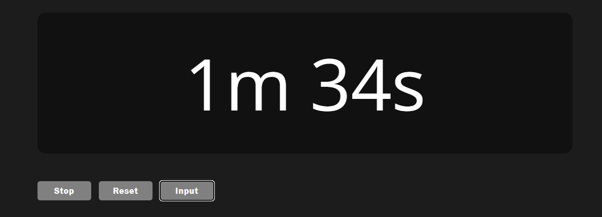
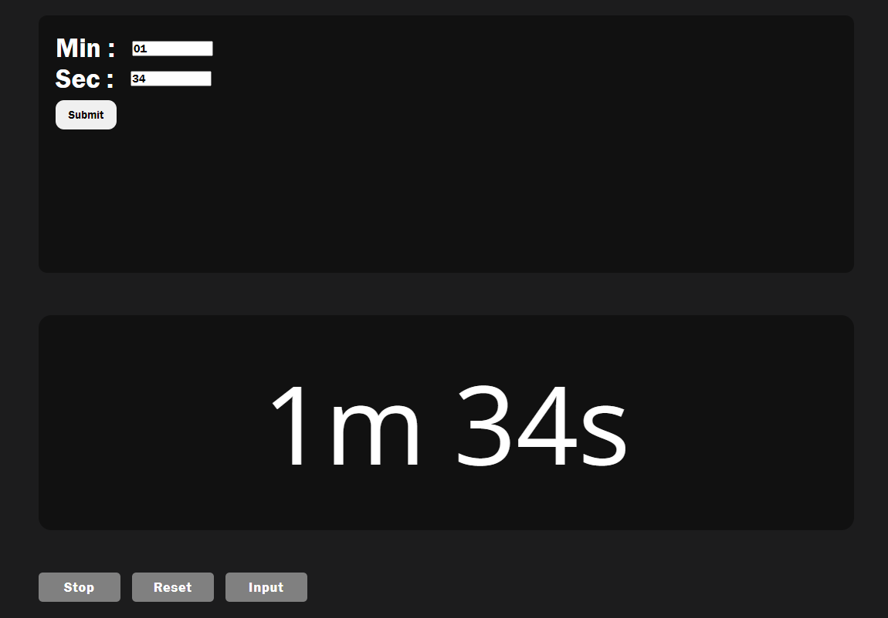

# ⏲️ Simple Timer

A minimalist timer application built with HTML, CSS, and JavaScript. This timer allows you to start, stop, reset, and set a countdown time specified by the user.

## Screenshots
<p align="center">
  
</p>
<p align="center">
  
</p>

## Features

- **Start:** Begin the countdown timer.
- **Stop:** Pause the countdown at any time.
- **Reset:** Reset the timer to the initial state.
- **User Input:** Set a custom countdown time by inputting minutes and seconds.

## Technologies Used


## Demo

Check out the live demo of the Timer [here](iDhruv11.github.io/Timer/).

## Getting Started

To get a local copy up and running, follow these simple steps:

### Prerequisites

- Clone the repository:
  ```bash
  git clone https://github.com/your-username/timer.git
